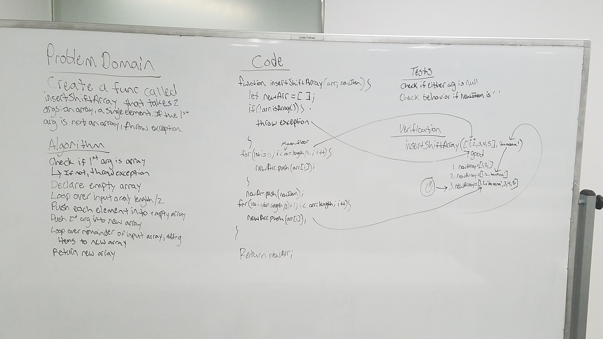

# Array Shift Code Challenge

Write a function that takes an array as a first argument and a single item as a second argument. If first argument is not an array, throw an error. If it is, insert the new item into the middle of the array.

## Running the tests

There are two total tests here; one to ensure that the output is correct, the other to ensure that the first argument is indeed an array..

