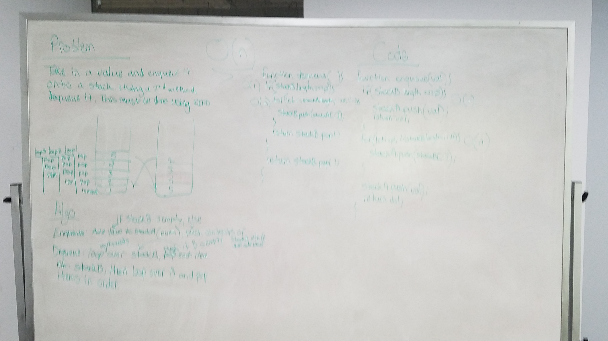

# LL Kth from End

Write a function that takes two linked lists and merges them, one node after the other, zipper fashion. Throw error if either list is empty.

## Running the tests

1. Testing to ensure popped value is correct.
2. Testing to ensure stackA is properly populated in the correct order.
3. Testing to ensure popped values are correct when running multiple enqueues and dequeues in succession.

##### Note: Whiteboard represents my initial attempt at solving this, prior to having some concepts laid out.
