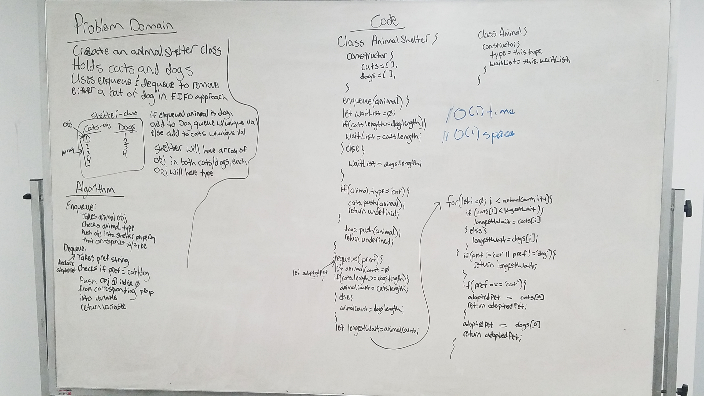

# LL Kth from End

Write a function that takes two linked lists and merges them, one node after the other, zipper fashion. Throw error if either list is empty.

## Running the tests

1. Testing to ensure the correct animal type dequeued
2. Testing to ensure the correct animal order dequeued
3. Testing to ensure the longest waiting animal dequeued when pref does not equal cat or dog

##### To run all tests: 

```
npm run test
```

