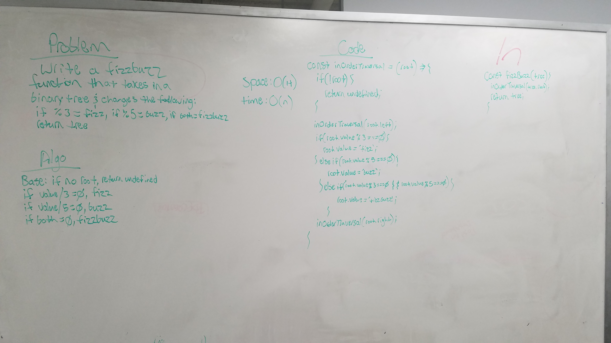

# LL Kth from End

Write a function that takes two linked lists and merges them, one node after the other, zipper fashion. Throw error if either list is empty.

## Running the tests

1. Testing to ensure % 3 = "fizz"
2. Testing to ensure % 5 = "buzz"
3. Testing to ensure % 3 and % 5 = "fizzbuzz"

##### To run all tests: 

```
npm run test
```

