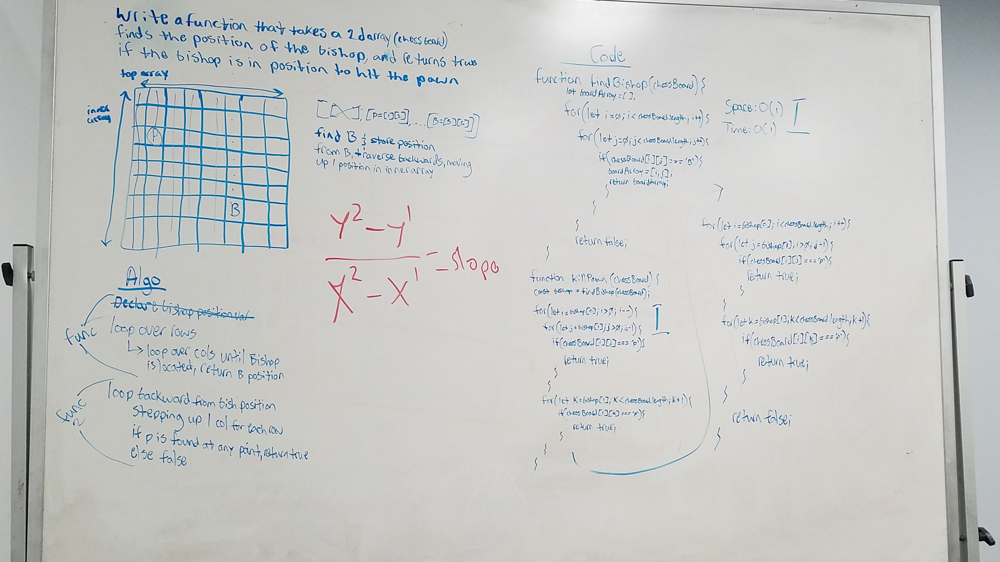

# Repeated Word

Write a function that takes a chess board (2D array) with a single pawn and single bishop as an argument and returns true if the bishop is in a position to take out the pawn..

## Running the tests

1. Testing to ensure truthy return if bishop can reach pawn
2. Testing to ensure falsey return if bishop cannot reach pawn

