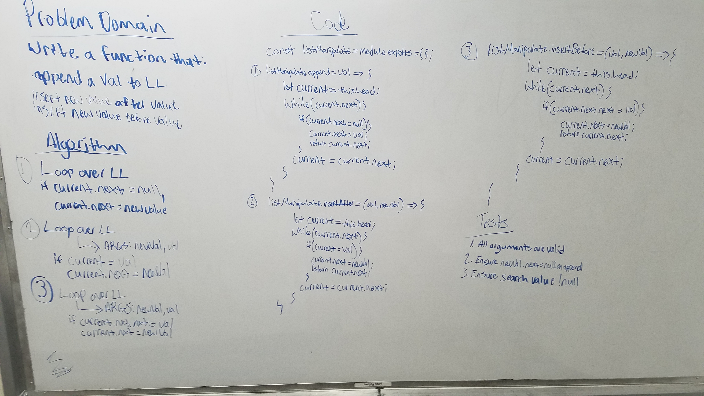

# Linked List Insertions

Write a function to append a new value onto a linked list.

## Running the tests

1. Test: ensure that specified value exists at end of list after running appender function.
2. Test: ensure error is thrown if trying to add to an empty list.

