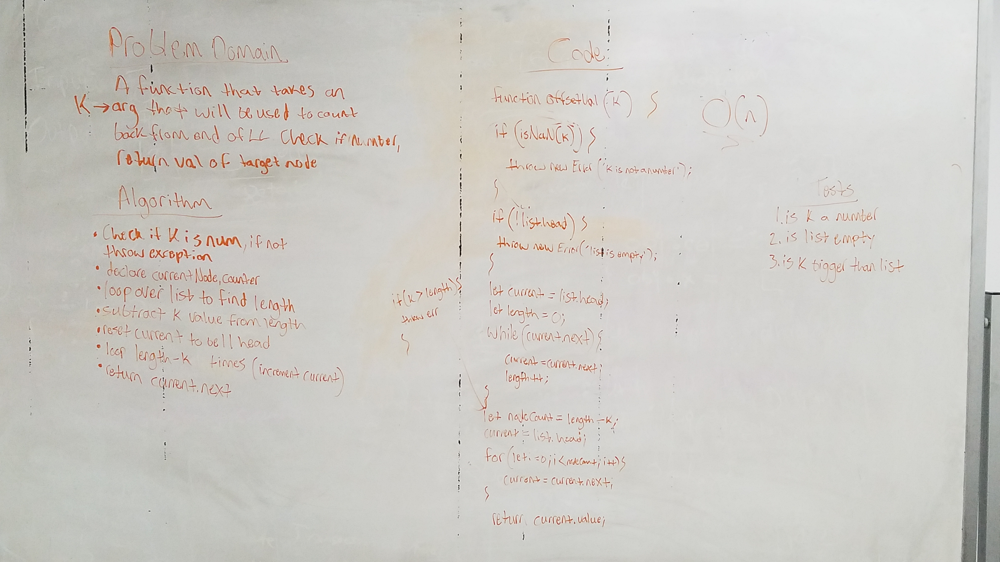

# LL Kth from End

Write a function that takes a number value and a linked list as arguments. Using the number argument, count back x amount of times from the end of the linked list and return the value of that node.

## Running the tests

1. Testing to see if K is a number
2. Testing to check if list is empty
3. Testing to check if K is bigger than list length

