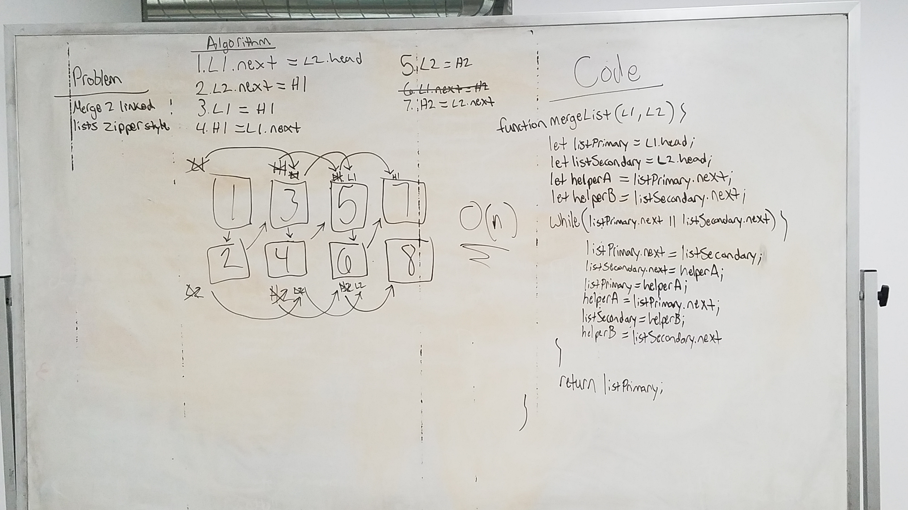

# LL Kth from End

Write a function that takes two linked lists and merges them, one node after the other, zipper fashion. Throw error if either list is empty.

## Running the tests

1. Testing to ensure both lists have nodes
2. Testing to ensure output list is as expected (listOne.head > listTwo.head > listOne.next > listTwo.next)
3. Testing to check if lists of varied lengths are as expected

##### NOTE: My tests are currently in progress. I'm experiencing some difficulties that will be resolved soon.

