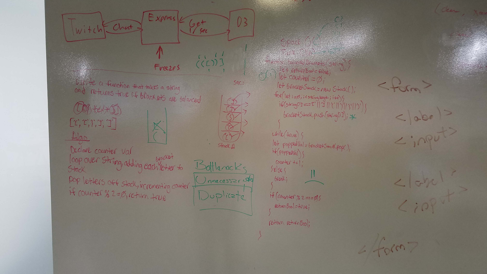

# Repeated Word

Write a function that takes in a string and returns true if the brackets in the string are correctly formatted.

## Running the tests

1. Testing to ensure truthy return on a properly formatted string
2. Testing to ensure falsey return on an improperly formatted string
3. Testing to ensure falsey return if string is empty

