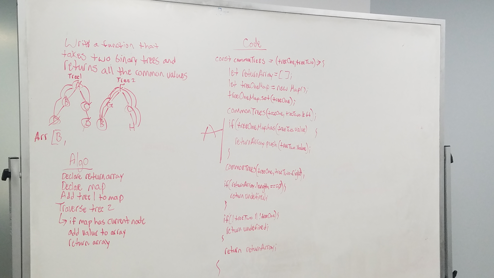

# Repeated Word

Write a function that takes two binary trees and returns the common values between the two.

## Running the tests

1. Testing to ensure the correct values are returned (two separate tests)
2. Testing to ensure undefined is returned if there are no common values

