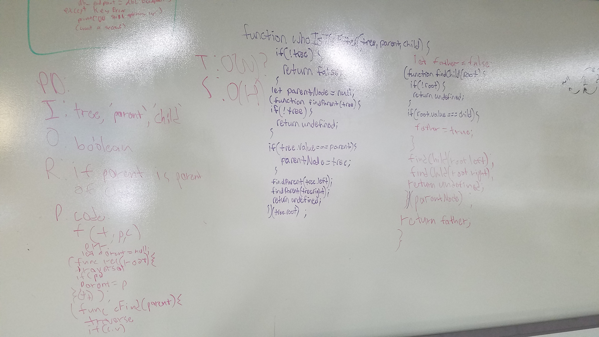

# Repeated Word

Write a function that takes in arguments of a binary tree, a parent, and a child. Return true if the child is actually a descendant of parent.

## Running the tests

1. Testing to ensure truthy return on a parent child match
2. Testing to ensure falsey return if child is not child
3. Testing to ensure falsey return if tree is empty

